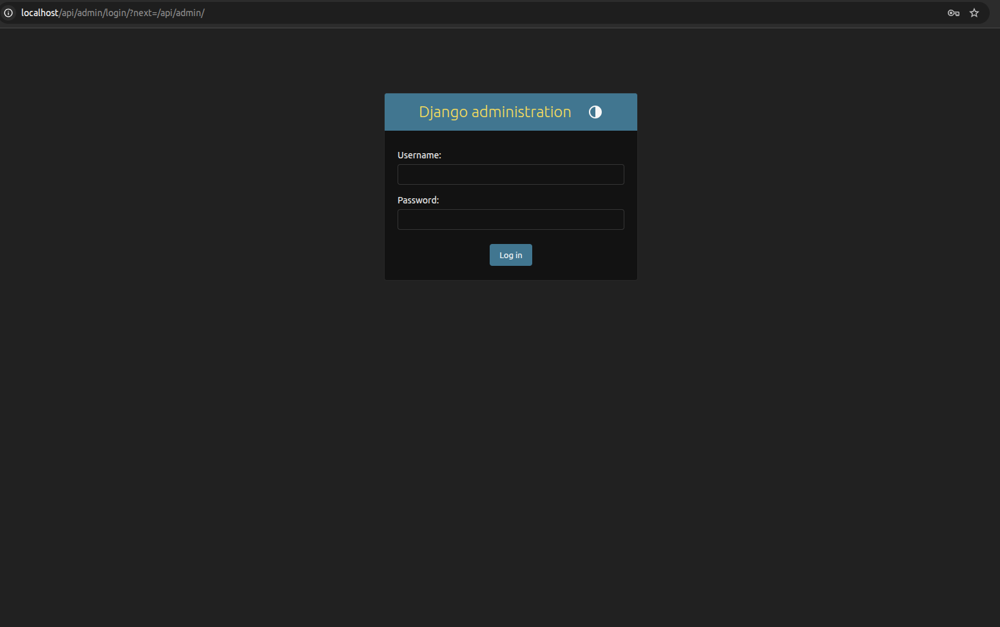
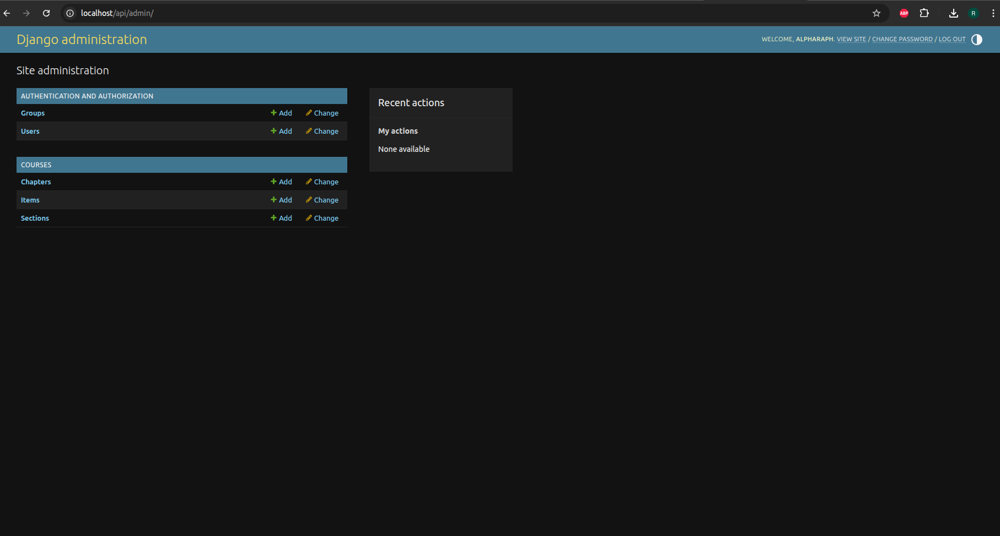

# Documentation Backend pour le Frontend

Toutes les étapes sont nécessaires afin que le backend fonctionne correctement sur votre ordinateur.

## Importer le backend depuis github
Aller dans votre dossier projet (le dossier qui contient les dossiers backend et frontend), puis mettez à jour les
fichiers à l'aide de \
`git pull` \
Ensuite, vous devez mettre à jour les fichiers dans le dossier backend :  \
`git switch dev` \
`git pull`

## Initialiser la base de données
Le code backend (qui se trouve dans backend/) est indépendant de la base de données postgresql (qui se trouve dans un 
volume nommé "codeclique_postgres_data" de docker).
Une fois que vous avez importé la dernière version du backend, la base de données (bdd) ne s'est pas automatiquement mise à jour pour correspondre au code backend.
Il faut donc la mettre à jour en éxécutant la commande suivante après avoir lancé docker (`docker compose up --build`): \
`docker compose exec backend python manage.py migrate` \
(pour exécuter une commande avec le conteneur docker lancé, il suffit d'ouvrir un autre terminal dans le même dossier) \
S'il y a des conflits dans les migrations (=mises à jour de la base de données), n'hésitez pas à vider de la base de 
données (seulement votre version locale sera vidée) en supprimant le volume codeclique_postgres_data (avec la commande
`docker volume remove codeclique_postgres_data` ou `docker compose down -v`). Ensuite réexécuter la commande ci-dessus.

## Remplir la base de données
Quand vous lancez pour la première fois le site avec Docker, et donc le backend, la base de données est vide. Afin que les endpoints ci-dessus ne renvoient pas des listes et des JSON vides, il est préférable pour le développement du frontend d'ajouter du contenu dans la base de données. Pour cela, deux options : 
1. Lancer la commande suivante : \
`docker compose exec -T backend python manage.py shell -c "exec(open('fill_database.py').read())"` \
Le script fill_database.py va faire le travail.

2. Utiliser l'administration Django pour apprendre à manipuler la bdd :
 
   1) Lancez votre serveur docker
   `docker compose up` ou `docker compose up --build` si vous venez d'importer le backend

   2) Créez-vous un superuser avec la commande suivante
   `docker compose exec backend python manage.py createsuperuser`
   Renseignez alors un identifiant et un mot de passe, l'adresse mail est facultative (taper juste [Entrer]) (tout est en local, vous pouvez mettre n'importe quoi).

   3) Accéder à l'admin Django via l'url suivant : 
   `localhost/api/admin/`
   Il devrait alors s'afficher l'interface suivante : 
   
   Puis, après avoir entré les identifiants que vous venez de créer, vous devriez avoir l'interface suivante : 
   


L'interface est normalement très intuitive, vous pouvez maintenant ajouter, modifier et supprimer autant de modèles (=tuples de la bdd) que vous voulez dans la base de données !
Afin de faire vos tests pour le frontend, vous pouvez par exemple ajouter les objets `Node` suivants dans la base de données : 

- 2 `Node` de type `Chapitre` : 
  - title : `Chapitre 1 : Variables` \
  type : `Chapitre` \
  description : ce que vous voulez \
  grade_level : `Seconde` \
  subject : `Mathématiques` \
  content : `""`
  - title : `Chapitre 2 : Les boucles` \
  type : `Chapitre` \
  description : ce que vous voulez \
  grade_level : `Seconde` \
  subject : `Mathématiques` \
  content : `""`


- 3 `Node` de type `Partie` pour le chapitre 2 :
  - title : `Partie 1 : les conditions` \
  type : `Partie` \
  difficulty : `1` \
  subject : `Mathématiques` \
  content : `""` \
  parents : Chapitre 2 : Les boucles (il faut l'ajouter via l'interface `Node nodes`)

  - title : `Partie 2 : les boucles - while` \
  type : `Partie` \
  difficulty : `1` \
  subject : `Mathématiques` \
  content : `""` \
  parents : Chapitre 2 : Les boucles (il faut l'ajouter via l'interface `Node nodes`)

  - title : `Partie 3 : les boucles - for` \
  type : `Partie` \
  difficulty : `1` \
  subject : `Mathématiques` \
  content : `""` \
  parents : Chapitre 2 : Les boucles (il faut l'ajouter via l'interface `Node nodes`)


- 4 `Node` de type `Leçon` ou `Exercice` pour la Partie 1 :
  - title : `Introduction et I` \
  type : `Leçon` \
  content : 
    ```json
    {
      "content": "## INTRODUCTION\nJusqu'à présent, nos programmes étaient linéaires : ils exécutaient les instructions les unes après les autres, toujours de la même façon. Mais dans la vie, on fait des choix ! \"S'il pleut, je prends un parapluie, sinon je mets des lunettes de soleil\". En Python, c'est pareil : on utilise des \"conditions\" pour dire à l'ordinateur d'exécuter certaines lignes de code seulement si une condition est remplie.\n\n## I/ L'instruction \"if\" (si) \nC'est la base de la condition. On teste si quelque chose est Vrai (True).\n\n**Syntaxe :** \n```python\nif condition : \n    # Instruction à exécuter si c'est vrai\n```\n\n**⚠️ Attention !**   \nNe pas oublier les deux points \":\" à la fin de la ligne du if.  \nL'indentation (le décalage vers la droite) est obligatoire ! C'est elle qui dit à Python : \"cette ligne fait partie du bloc conditionnel\".\n\n**Exemple :** \n```python\nage = 18 \nif age >= 18: \n    print(\"Vous êtes majeur !\")\n```\n\n## II/ L'instruction \"else\" (sinon) \nC'est l'alternative. Si la condition du if est fausse, alors on exécute ce qu'il y a dans le else.\n\n**Syntaxe :** \n```python\nif condition : \n    # Fait ça si c'est vrai \nelse : \n    # Fait ça si c'est faux\n```\n\n**Exemple :** \n```python\nnote = 8 \nif note >= 10: \n    print(\"Bravo, tu as la moyenne !\") \nelse: \n    print(\"Il faut encore réviser un peu.\")\n```"
    }
    ```
    difficulty : `1` \
    subject : `Mathématiques` \
    parents : Partie 1 : les conditions (il faut l'ajouter via l'interface `Node nodes`)
    
  - title : `exercice d'application directe I et II` \
    type : `Exercice` \
    content : 
    ```json
    {
      "content": "1) Crée une variable mot_de_passe. Si le mot de passe est \"PythonIsCool\", affiche \"Accès autorisé\", sinon affiche \"Accès refusé\".",
      "answer": "Le résultat attendu du programme."
    }
    ```
    difficulty : `1` \
    subject : `Mathématiques` \
    parents : Partie 1 : les conditions (il faut l'ajouter via l'interface `Node nodes`)

  - title : `III` \
  type : `Leçon` \
  content : 
    ```json
    {
      "content": "## III/ L'instruction \"elif\" (sinon si) \nParfois, le monde n'est pas tout blanc ou tout noir, il y a plusieurs cas possibles. elif (contraction de \"else if\") permet de tester une nouvelle condition si la première est fausse.\n\n**Exemple :**\n```python\ntemperature = 20\n\nif temperature > 30: \n    print(\"Il fait très chaud !\") \nelif temperature > 15: \n    print(\"Il fait bon.\") \nelse: \n    print(\"Il fait froid, mets un manteau !\")\n```"
    }
    ```
    difficulty : `1` \
    subject : `Mathématiques` \
    parents : Partie 1 : les conditions (il faut l'ajouter via l'interface `Node nodes`)

  - title : `exercice d'application directe III` \
  type : `Exercice` \
  content : 
    ```json
    {
      "content": "2) Crée une variable x. Affiche si le nombre est positif, négatif ou nul (indice : utilise elif).",
      "answer": "Le résultat attendu du programme."
    }
    ```
    difficulty : `1` \
    subject : `Mathématiques` \
    parents : Partie 1 : les conditions (il faut l'ajouter via l'interface `Node nodes`)